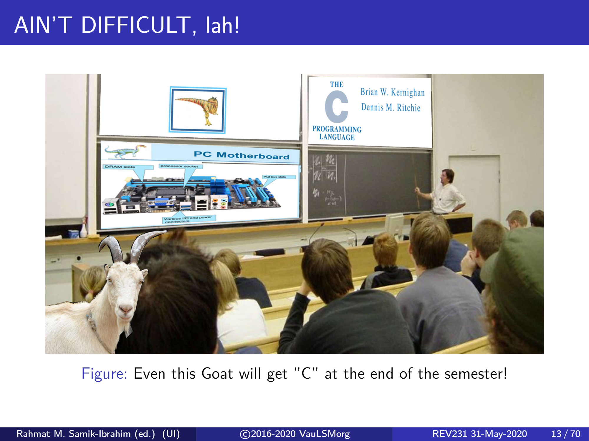

### Kumpulan URL penting untuk OS

- [OS.VLSM.ORG by Pak RMS](https://os.vlsm.org/)
- [BLOG Pak RMS](https://rahmatm.samik-ibrahim.vlsm.org/)
- [Kanal Youtube Pak RMS](https://www.youtube.com/channel/UCpCmOF7bwVaKIQkvBKBXhLQ)
- [Kanal Youtube Pak Anwar](https://www.youtube.com/channel/UCi3sVI10RtRaVWuq1SOVaSg)
- [Kanal Youtube Pak Grafika](https://www.youtube.com/user/31graf)
- [Operating System Concepts (Silberschatz et.al.)](https://codex.cs.yale.edu/avi/os-book/)
- [GNU Bash, Brief Introduction](https://en.wikipedia.org/wiki/Bash_(Unix_shell)
- [BASH](https://ryanstutorials.net/bash-scripting-tutorial/)

### Bonus

- [Markdown Tutorial for Github Pages](https://guides.github.com/features/mastering-markdown/)

###### Ayo belajar! jangan mau dapet C seperti kambing!!
###### Image copyright: Pak RMS

Mengutip dosen tercinta Pak RMS, izinkan saya mengakhiri halaman ini dengan:

> Jolan Tru! -RMS

### Jolan Tru!

A Muhammad Zakiy Saputra 1806205741

[Antar saya kembali ke halaman semula!](../)